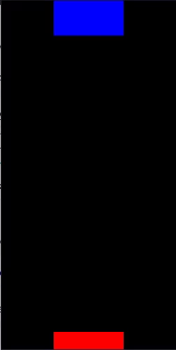

# TETRIS-OpenGL

TETRIS block stacker with modern OpenGL 

## About the project

The game was made with no previous knowledge about how TETRIS game 
mechanics and how code behind other implementations work. 
This was done deliberately to at the end compare my solutions to others. 
There's a lot of things wrong with the code 
(you can find comments about some of them in the code).
This is pretty much just a "prototype", 
trying out stuff and getting a basic idea of how the game would work 
if I decided to "actually make it". Feedback is very much appreciated
## The game right now
The movement works well, and rotation is fine, I might add a feature so 
that the block finds a suitable
position when rotating (by moving up/right or left depending on the situation) 
so it doesn't get blocked. Currently it's just a stacker, 
it generates a series of random blocks and a random speed in tetris.cfg. It will spawn
the blocks and your goal is to get all of the blocks to spawn (it's sometimes nearly impossible, you can edit the config manually). If there's collision on spawn (the blue area is the spawn point), the game will reset.

You can download the binary from [here.](https://github.com/MaWke/TETRIS-OpenGL/releases/download/v0.1/Tetris.exe)
Although I do recommend you compile everything you find on github yourself just in case.

## Statically linked libraries
https://github.com/glfw/glfw

https://github.com/nigels-com/glew

